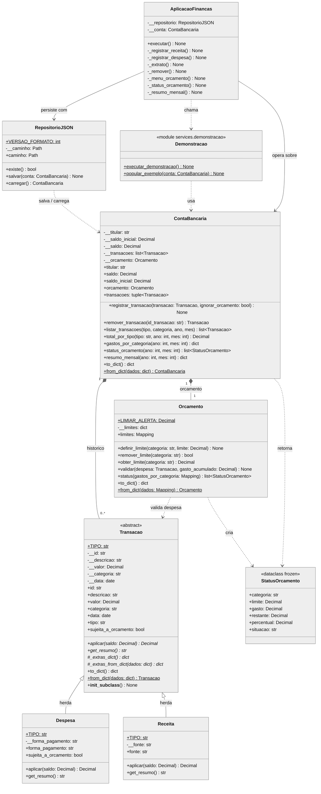
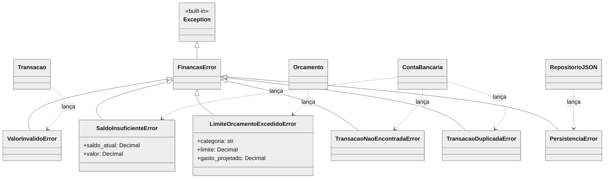

# Diagrama de Classes UML

Sistema de Gestão Financeira Pessoal e Orçamento Doméstico.
Os diagramas usam sintaxe [Mermaid](https://mermaid.js.org/) e renderizam
diretamente no GitHub, GitLab, VS Code (extensão *Markdown Preview Mermaid*)
ou em <https://mermaid.live>.

**Notação de visibilidade:** `+` público · `-` privado (atributo `__x` do Python,
com *name mangling*) · `#` protegido (`_x`). Métodos abstratos terminam com `*`;
membros estáticos/de classe com `$`.

---

## 1. Diagrama principal (domínio, serviços e interface)

---

## 2. Hierarquia de exceções de domínio

---

## 3. Legenda: relação UML → conceito de POO

| Relação no diagrama | Onde aparece | Conceito de POO |
|---|---|---|
| `Transacao <\|-- Despesa / Receita` | herança | **Herança** e **Abstração** (`Transacao` é `ABC`, não instanciável) |
| `aplicar()` e `get_resumo()` (abstratos em `Transacao`, concretos nas filhas) | polimorfismo | **Polimorfismo** por sobrescrita: `ContaBancaria` chama `aplicar()` sem saber o tipo |
| `-__saldo`, `-__transacoes`, `-__limites` + `+saldo` (somente leitura) | atributos privados com *property* | **Encapsulamento**: o saldo só muda via `registrar_transacao` / `remover_transacao` |
| `ContaBancaria *-- Transacao` e `ContaBancaria *-- Orcamento` | losango preenchido | **Composição**: o ciclo de vida dos filhos depende da conta |
| `Orcamento ..> Transacao` | dependência | O orçamento valida limites por categoria recebendo a despesa como parâmetro |
| `Transacao.from_dict` + `__init_subclass__` | *factory* com registro automático | Extensibilidade (Aberto/Fechado): nova subclasse com `TIPO` é reconstruída sem alterar a base |
| `RepositorioJSON ..> ContaBancaria` | dependência | **Persistência** isolada em uma classe (responsabilidade única) |
| `AplicacaoFinancas --> RepositorioJSON / ContaBancaria` | associação | Separação entre interface (menu) e regras de negócio |
| `FinancasError` e derivadas | hierarquia de exceções | **Tratamento de exceções** com tipos próprios do domínio |
